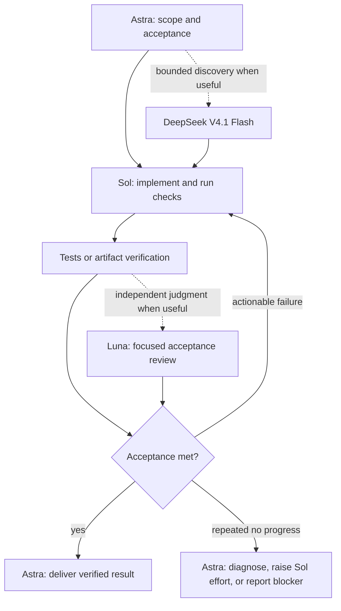

# Quota Flow

**Astra orchestrates. Sol implements. DeepSeek V4.1 Flash and Luna support.**

A reusable Codex skill for features, bug fixes, refactors, skill creation, and
verified artifacts. It minimizes avoidable model calls, duplicated context, and
unproductive retries while keeping acceptance checks intact.



## Install

Requires Python 3.11+, Codex with custom-agent support, access to the listed OpenAI
models, and an already configured `codex-router` provider for Flash. Installation
does not create accounts or grant model access.

```bash
git clone https://github.com/codejunkie99/quota-flow.git
cd quota-flow
python3 scripts/install.py
python3 scripts/install.py --check
```

The installer adds one skill, one prompt, four narrowly scoped agent profiles, and
a launcher to your Codex home. It refuses conflicting files and leaves global
configuration intact. Restart/open a fresh Codex task to load the new profiles.

## Use

In the desktop app, select **Astra / Low** and use:

```text
$quota-flow Implement the feature described below and verify the result.
```

Legacy Codex CLI/IDE compatibility slash command (only on clients that still
support custom prompts):

```text
/prompts:quota-flow Fix the failing checkout tests and verify the fix.
```

Custom prompts are deprecated; `$quota-flow` is the preferred invocation. The
tested Codex 0.153.4 CLI rejected `/prompts:quota-flow` as unrecognized, despite
the compatibility syntax remaining documented. Use the skill or launcher on that
build; the wrapper is included for older compatible clients.
`/quota-flow` is not claimed as a native Codex command. Desktop slash-menu support
is client-dependent; the installed skill works independently of that menu.

Or launch an interactive Astra session from your project directory:

```bash
"${CODEX_HOME:-$HOME/.codex}/bin/quota-flow" "Build the requested feature"
```

The launcher selects Astra/Low and standard service tier for this session. It
preserves your existing permissions and configuration. Invoking the skill within
an existing conversation does not change that conversation's model.

## What makes it economical

- The short default path uses Sol plus existing checks; support agents are optional.
- Sol owns the implementation and its repair loop, avoiding an Astra turn per edit.
- Compact packets and reusable worker context reduce repeated retrieval and handoffs.
- One active worker by default; at most two on disjoint useful work; no recursive teams.
- Medium-effort Sol by default, high only for a demonstrated need; Luna starts low.
- Two unchanged failure cycles trigger diagnosis; another failed intervention ends
  that branch with saved state. Progressing work continues within the user's budget.
- Skill creation uses progressive disclosure, script validation, and behavioral
  checks. Bug fixes use reproductions and relevant regression checks.

The exact defaults are engineering choices, not benchmark-proven global optima.
Astra coordination still consumes quota; for tiny tasks, coordination can cost
more than working directly. This package preserves the requested Astra/Sol roles.
Models may share account limits, and the Flash provider has its own accounting.
There is no promised savings percentage or hard billing enforcement.

## Contents and verification

- [Skill](skills/quota-flow/SKILL.md)
- [Routes, model identity, usage calibration](skills/quota-flow/references/runtime.md)
- [Task adapters](skills/quota-flow/references/task-adapters.md)
- [Agent profiles](agents/)
- [Slash command](prompts/quota-flow.md)
- [Validation results](VALIDATION.md)

```bash
python3 -m unittest discover -s tests -v
python3 scripts/install.py --check
```

Remove only unchanged installed files with:

```bash
python3 scripts/install.py --uninstall
```

## Sources

Runtime syntax follows OpenAI's [custom-agent documentation](https://learn.chatgpt.com/docs/agent-configuration/subagents),
[skill documentation](https://learn.chatgpt.com/docs/build-skills), and
[custom-prompt compatibility documentation](https://learn.chatgpt.com/docs/custom-prompts).
See [Codex pricing](https://learn.chatgpt.com/docs/pricing) for current account usage
rules. Exact shipped model IDs and reasoning levels were checked against a local
Codex 0.153.4 model catalog on 2026-09-12; availability must be checked per installation.
